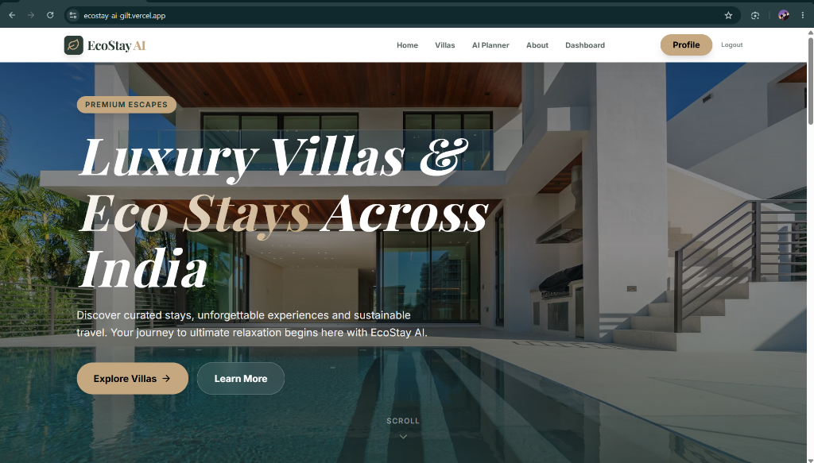
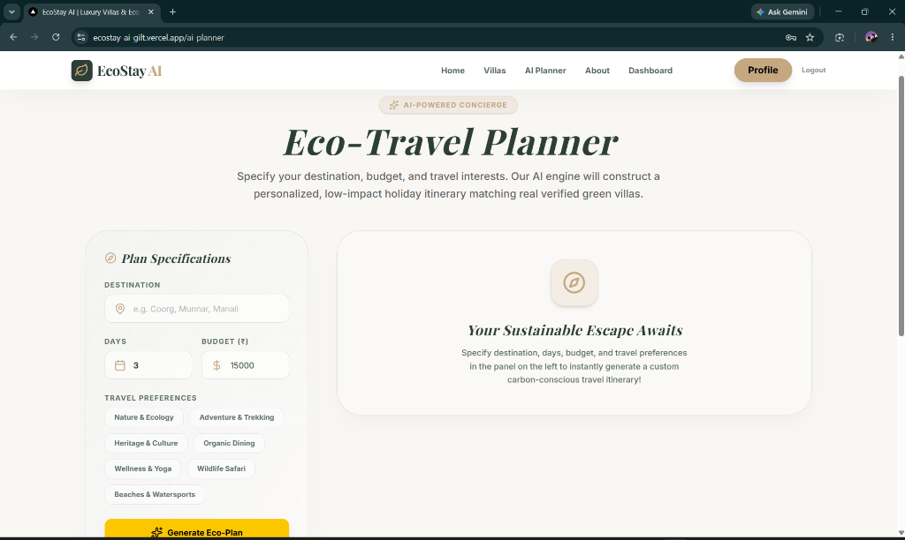
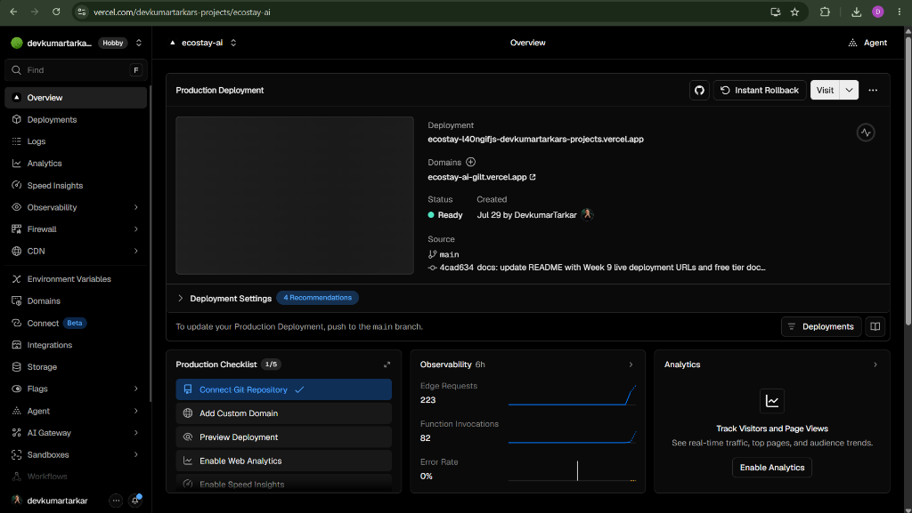
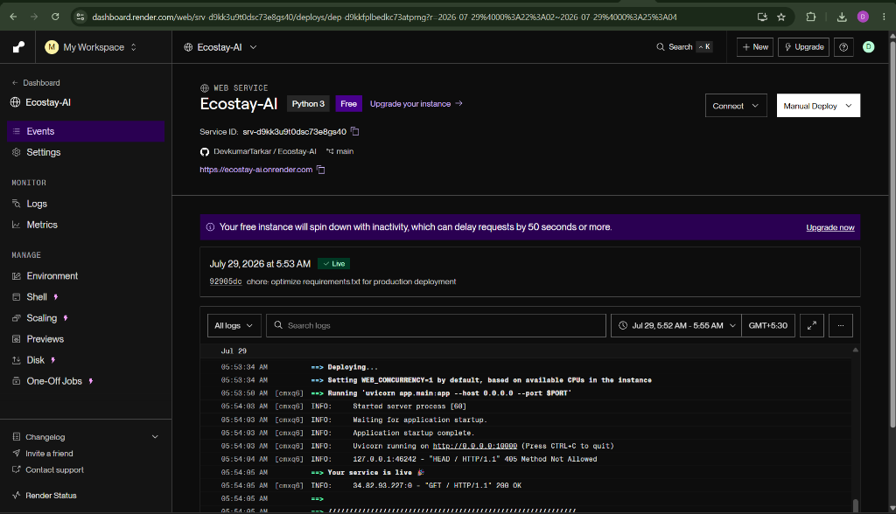

# 🌿 EcoStay AI

> An AI-Powered Eco-Tourism & Sustainable Homestay Booking Platform connecting eco-conscious travelers with verified green stays and personalized low-impact travel itineraries.

---

## 🔗 Live Demo
- **Live Application (Vercel)**: [https://ecostay-ai-gilt.vercel.app](https://ecostay-ai-gilt.vercel.app)
- **Live Backend REST API (Render)**: [https://ecostay-ai.onrender.com](https://ecostay-ai.onrender.com)
- **GitHub Repository**: [https://github.com/DevkumarTarkar/Ecostay-AI](https://github.com/DevkumarTarkar/Ecostay-AI)

---

## 📺 Demo Video
- **YouTube (Unlisted)**: [Watch Capstone Demo Video](YOUR_YOUTUBE_UNLISTED_LINK_HERE)

---

## 🖼️ Application Screenshots

<p align="center">
  
  
</p>
<p align="center">
  
  
</p>

---

## ✨ Features

- **Eco-Stay Discovery**: Browse verified sustainable villas and homestays across India with real-time property details.
- **AI Travel Concierge**: Generate personalized, carbon-conscious travel itineraries based on destination, duration, budget, and travel preferences using Google Gemini AI.
- **Full CRUD Persistence**: Add, read, update, and delete homestays persisted directly in PostgreSQL / SQLite database.
- **JWT & OAuth Authentication**: Secure registration and login using JWT tokens with route protection guards, plus OAuth 2.0 (Google & GitHub).
- **API Rate Limiting**: Slowapi rate limiter protecting sensitive authentication endpoints (5 requests/minute).
- **Responsive UI**: Sleek, modern glassmorphism design with mobile-first responsive layout (optimized down to 375px).

---

## 🛠️ Tech Stack

| Category | Technologies |
|----------|--------------|
| **Frontend** | Next.js 16 (App Router), React, TypeScript, Tailwind CSS, Framer Motion, Lucide Icons |
| **Backend** | FastAPI (Python 3.11), SQLAlchemy ORM, Pydantic v2, slowapi |
| **Database** | PostgreSQL (Hosted on Supabase) with local SQLite fallback |
| **AI Integration** | Google Gemini REST API (`gemini-1.5-flash`) |
| **Auth Protocol** | NextAuth.js (Frontend) & JWT / OAuth 2.0 (Backend) |
| **Hosting & Deployment** | Vercel (Frontend) & Render (Backend) |

---

## 🚀 Setup Instructions

Follow these steps to clone and run EcoStay AI locally on your machine.

### Prerequisites
- Node.js v18+ and `npm`
- Python v3.10+
- Git

### 1. Clone the Repository
```bash
git clone https://github.com/DevkumarTarkar/Ecostay-AI.git
cd Ecostay-AI
```

### 2. Backend Setup
```bash
cd backend
python -m venv .venv
# On Windows PowerShell:
.\.venv\Scripts\Activate.ps1
# On Linux/macOS:
source .venv/bin/activate

pip install -r requirements.txt
```

Create `.env` inside `backend/`:
```env
DATABASE_URL=sqlite:///./test.db
SECRET_KEY=your_secret_key_here
GEMINI_API_KEY=your_gemini_api_key
```

Run Backend Server:
```bash
uvicorn app.main:app --reload --port 8000
```
Backend API will run at `http://localhost:8000`.

### 3. Frontend Setup
From repo root:
```bash
npm install
```

Create `.env.local` in project root:
```env
NEXT_PUBLIC_API_URL=http://localhost:8000/api
NEXTAUTH_URL=http://localhost:3000
NEXTAUTH_SECRET=your_nextauth_secret
GOOGLE_CLIENT_ID=your_google_client_id
GOOGLE_CLIENT_SECRET=your_google_client_secret
GITHUB_CLIENT_ID=your_github_client_id
GITHUB_CLIENT_SECRET=your_github_client_secret
```

Run Frontend Development Server:
```bash
npm run dev
```
Open `http://localhost:3000` in your browser.

---

## 📑 API Documentation

Below is a summary of core backend REST endpoints:

### Authentication
- `POST /api/auth/register` — Register a new user account.
- `POST /api/auth/login` — Authenticate and receive JWT access token.
- `GET /api/auth/me` — Retrieve current authenticated user profile.

### Homestays (CRUD)
- `GET /api/homestays/` — List all eco homestays (with search & filter options).
- `GET /api/homestays/{id}` — Get detailed information for a specific stay.
- `POST /api/homestays/` — Create a new eco homestay listing (Authenticated).
- `PUT /api/homestays/{id}` — Update property details (Authenticated).
- `DELETE /api/homestays/{id}` — Delete property listing (Authenticated).

### AI Travel Planner
- `POST /api/ai/travel-plan` — Generate custom eco-itinerary via Google Gemini API.

#### Request Example:
```json
{
  "destination": "Manali",
  "days": 3,
  "budget": 15000,
  "interests": ["Nature & Ecology", "Organic Dining"]
}
```

---

## 🏗️ Architecture & Folder Structure

```text
Ecostay-AI/
├── app/                  # Next.js App Router (Frontend pages & components)
│   ├── about/            # About page
│   ├── ai-planner/       # AI Travel Concierge page
│   ├── dashboard/        # Authenticated user dashboard
│   ├── login/            # Login & Register pages
│   ├── villas/           # Homestays discovery & detail pages
│   └── page.tsx          # Homepage
├── backend/              # FastAPI Backend Application
│   └── app/
│       ├── database.py   # SQLAlchemy engine & session setup
│       ├── main.py       # FastAPI application entrypoint & CORS
│       ├── models/       # Database ORM models (User, Homestay)
│       ├── routes/       # API Route controllers (auth, homestays, ai)
│       └── services/     # Business logic & Gemini AI integration
├── screenshots/          # Embedded README screenshot assets
├── vercel.json           # Vercel deployment configuration
└── README.md             # Production documentation
```

---

## ⚠️ Known Limitations

- **Render Free Tier Cold Starts**: The backend is hosted on Render's free tier, which sleeps after 15 minutes of inactivity. Initial request after idle takes **30–60 seconds** to wake up.
- **Database Pooling**: Supabase connection pooling may exhibit slight initial latency during instance spin-up.
- **Offline Fallback Mode**: If the Gemini API key is missing or encounters a network timeout, the system seamlessly returns a pre-structured eco-itinerary fallback.

---

## 💖 Credits & Acknowledgements

- **TBI-GEU Internship Program**: For guidance and capstone project framework.
- **Google Gemini API**: For powering the AI Eco-Travel Concierge.
- **Next.js & FastAPI Teams**: For robust developer frameworks.
- **Open Source Community**: Lucide Icons, Framer Motion, Tailwind CSS, and ReportLab.
